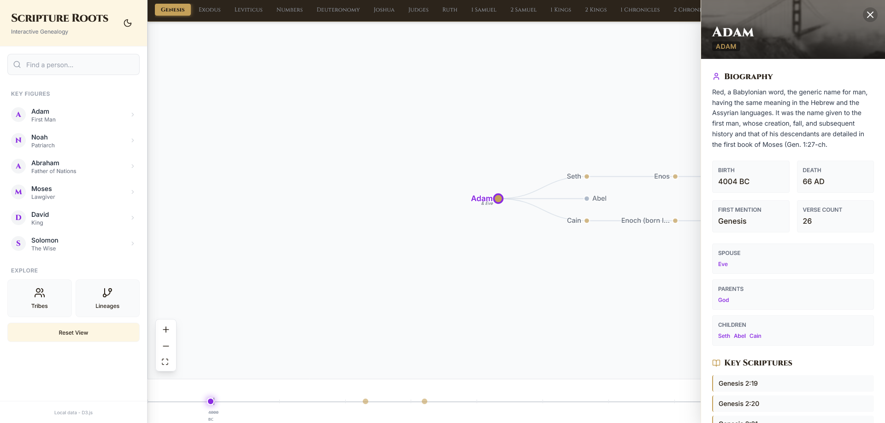
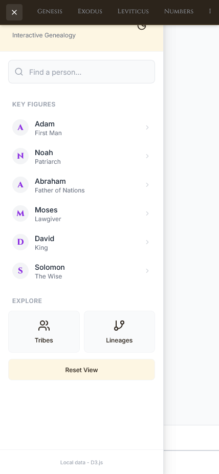

# Scripture Roots

Scripture Roots is a local-first, D3-based genealogy explorer for biblical people. It renders lineage relationships from prebuilt JSON data and provides fast, deterministic lookups without calling external AI services at runtime.

## Preview





## Highlights

- Local data only at runtime (no API calls in the app).
- Interactive D3 genealogy tree with lazy loading and auto-expand.
- Book-based filtering (first mention) and timeline navigation.
- Detailed person sidebar with family navigation.
- Mobile-friendly layout with off-canvas sidebar.

## Project Layout

- `App.tsx` drives page layout, data loading, and navigation behavior.
- `components/TreeGraph.tsx` renders the D3 tree, zoom/pan, and selection behavior.
- `components/Sidebar.tsx` handles search, key figures, and quick navigation.
- `components/DetailsPanel.tsx` shows person details and linked relatives.
- `components/BibleBooksBar.tsx` provides book filter and mobile menu toggle.
- `components/Timeline.tsx` provides chronological navigation.
- `services/personDataService.ts` loads local JSON files and resolves relationships.
- `scripts/build-theographic-data.py` generates local JSON files from the source dataset.

## How It Works

1. The app loads `public/data/root.json` as the initial tree root.
2. It auto-expands a few generations from the root on first load.
3. As you click nodes, children are fetched from local JSON and inserted into the tree.
4. The sidebar and details panel use local indexes for fast navigation.
5. Book filters build a new in-memory tree rooted at the selected book.

Everything is optimized for speed: the heavy data is pre-built, and runtime lookups are file-based and cached in memory.

## Data Model (Runtime)

The UI works with a normalized local dataset:

- `public/data/people.json` maps person IDs to labels and core attributes.
- `public/data/children.json` maps a person ID to their direct children IDs.
- `public/data/aliases.json` maps name variants to a canonical person ID.
- `public/data/root.json` contains the initial tree root (Adam).
- `public/data/details/*.json` stores detailed person records in buckets.

These files are read by `services/personDataService.ts` to build the D3 tree and the details panel.

## Data Sources and Attribution

The dataset is generated from:

- theographic-bible-metadata (CC BY-SA 4.0)
  - https://github.com/robertrouse/theographic-bible-metadata

The generated data includes Easton's Bible Dictionary entries and KJV verse references that are present in the source dataset.
No NIV text is bundled.

## Regenerating Local Data

If you update the source dataset or change the generator, rebuild the local files:

```bash
python scripts/build-theographic-data.py
```

This script rewrites:

- `public/data/people.json`
- `public/data/children.json`
- `public/data/aliases.json`
- `public/data/details/*.json`
- `public/data/root.json`

## Run Locally

Prerequisites:

- Node.js (LTS recommended)

Install dependencies:

```bash
npm install
```

Start the dev server:

```bash
npm run dev
```

## Contributing

Contributions are welcome. Please keep changes focused and local-first.

Recommended workflow:

1. Create a feature branch.
2. Make changes with minimal diffs.
3. Regenerate data only if you changed the generator or source data.
4. Run the app locally and verify key flows:
   - Search and node selection
   - Lazy loading of children
   - Book filter and clear filter
   - Details panel navigation
   - Mobile sidebar behavior
5. Open a PR with a clear description of the change.

### Guidelines

- Keep runtime data access local.
- Avoid adding network calls or API dependencies without discussion.
- Preserve existing UI behavior unless there is a strong reason to change it.
- Use ASCII in files that are already ASCII.

## License

This project contains data derived from CC BY-SA 4.0 sources. If you redistribute data or derivatives, follow the attribution and share-alike requirements of the source license.
